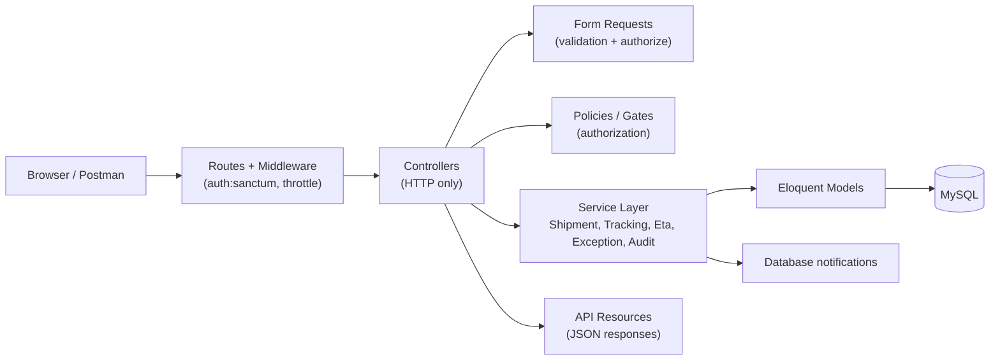
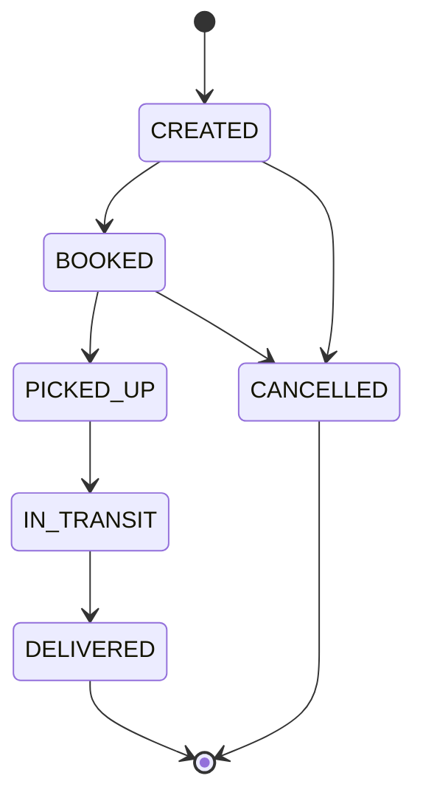
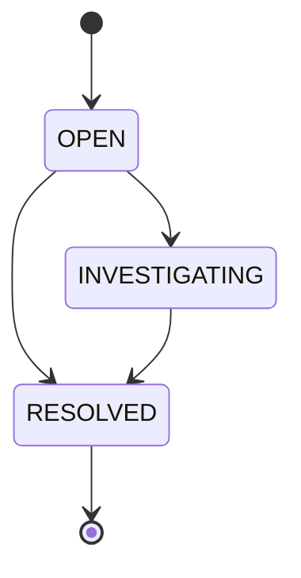

# Architecture

```mermaid
flowchart LR
    Client["Browser / Postman"] --> Routes["Routes + Middleware<br/>(auth:sanctum, throttle)"]
    Routes --> Controllers["Controllers<br/>(HTTP only)"]
    Controllers --> Requests["Form Requests<br/>(validation + authorize)"]
    Controllers --> Policies["Policies / Gates<br/>(authorization)"]
    Controllers --> Services["Service Layer<br/>Shipment, Tracking, Eta, Exception, Audit"]
    Services --> Models["Eloquent Models"]
    Models --> DB[("MySQL")]
    Services --> Notify["Database notifications"]
    Controllers --> Resources["API Resources<br/>(JSON responses)"]
```

## Shipment status lifecycle

```mermaid
stateDiagram-v2
    [*] --> CREATED
    CREATED --> BOOKED
    CREATED --> CANCELLED
    BOOKED --> PICKED_UP
    BOOKED --> CANCELLED
    PICKED_UP --> IN_TRANSIT
    IN_TRANSIT --> DELIVERED
    DELIVERED --> [*]
    CANCELLED --> [*]
```

## Exception lifecycle

```mermaid
stateDiagram-v2
    [*] --> OPEN
    OPEN --> INVESTIGATING
    OPEN --> RESOLVED
    INVESTIGATING --> RESOLVED
    RESOLVED --> [*]
```
